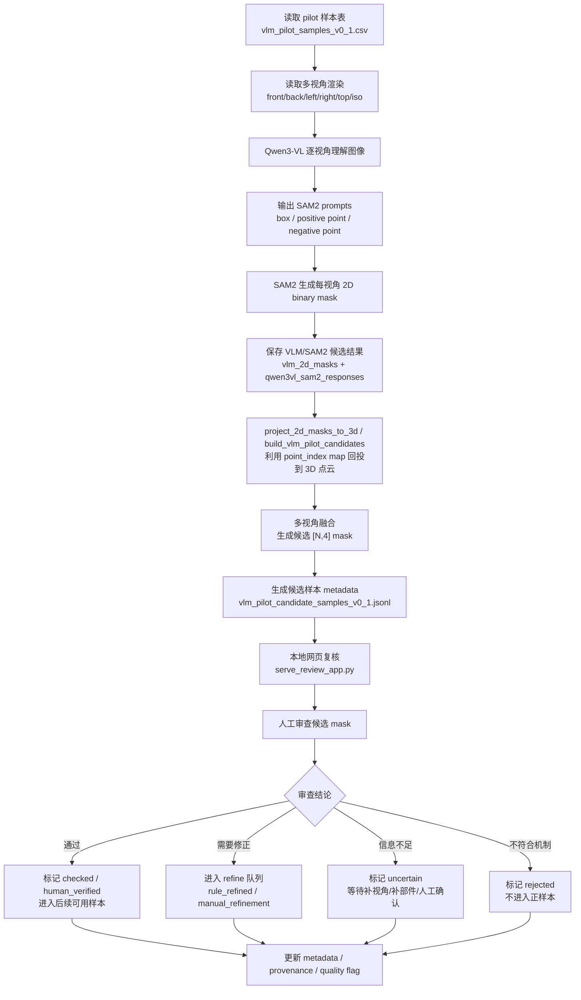

# Qwen3-VL + SAM2 候选标注与标注规范汇报稿

记录日期：2026-05-12 +08:00

本文档用于向导师汇报当前 Multi-EE Affordance Dataset v0.1 的候选标注流程、人工审查闭环，以及四类末端执行器和四类任务的标注边界。

## 1. 汇报目标

本次汇报主要说明三件事：

1. 当前不是直接训练模型，而是在构建物体级多执行器 3D affordance 数据集原型。
2. Qwen3-VL + SAM2 被定位为候选区域生成工具，用于发现漏标和加速人工审查，不作为最终 ground truth。
3. 最终标签仍然由任务、执行器机制、几何约束和人工审查共同决定。

## 2. 口头汇报稿

老师，我目前这个课题的核心目标是构建一个面向异构末端执行器的物体级 3D 多标签 affordance 数据集原型。传统 affordance grounding 通常是给定点云和任务，输出一个 mask；我这里希望同一个物体、同一个任务下，同时输出四个执行器通道的 mask，分别对应 `gripper`、`suction`、`hook` 和 `dexterous_hand`。

目前第一阶段不做训练，也不做完整室内场景，而是先把数据格式、标签边界、弱标签生成、可视化审查和候选标注流程跑通。已有的 3D AffordanceNet 可以提供物体级点云和原始 affordance 区域，但它本身不是按照末端执行器机制标注的，所以我们需要把它转成多执行器、多通道标签，并通过人工审查和后续候选挖掘逐步改进。

现在引入 Qwen3-VL + SAM2 的目的，不是让大模型直接生成最终逐点标签，而是把它作为候选标注生成器。具体流程是：先从 pilot 样本表中读取需要修正或补充的样本，然后读取这些样本的多视角渲染图，包括 front、back、left、right、top 和 iso。Qwen3-VL 对每个视角进行图像理解，根据当前任务和末端执行器类型，输出 SAM2 可用的 prompt，比如 box、positive point 和 negative point。随后 SAM2 在每个视角上生成 2D binary mask。

生成的 2D mask 会和模型响应一起保存下来，作为可追溯的候选结果。接下来使用渲染阶段保存的 `point_index map` 做 2D 到 3D 的回投。也就是说，每个渲染图像的像素都记录了它来自点云中的哪个点；如果某个像素被 SAM2 标成正区域，就给它对应的 3D 点投一票。多个视角投票后，再做融合，得到点级的候选 `[N,4]` mask。

这个候选 mask 不会直接进入数据集最终版本，而是会生成候选样本 metadata，并回到本地网页审查工具中进行人工复核。人工审查时分为四种结果：如果候选区域满足任务和执行器机制，就标记为 `checked` 或 `human_verified`；如果区域大体正确但边界需要修改，就进入 refine 队列；如果信息不足，就标记为 `uncertain`；如果不符合机制，就标记为 `rejected`。最终这些结论会写回 metadata 的 provenance 和 quality flag。

标注规范方面，我目前把四类执行器都定义成 canonical prototype，而不是绑定具体硬件型号。`gripper` 的核心机制是相对接触和夹持力，所以它不能标所有可接触表面，必须考虑潜在成对夹持面。`suction` 的核心机制是表面密封和法向吸附，所以它强调低曲率、连续、面积足够、法向可接近的局部表面。`hook` 的核心机制是插入、挂接和机械约束，因此必须判断能不能进入、能不能挂住、能不能沿任务方向施力。`dexterous_hand` 的核心机制是多指功能操作，它可以包覆、捏取、勾拉、按压，但也不能泛化成所有人手能碰到的表面。

四类任务中，`pick_up` 关注能否拿起，标注可以稍微宽一些；`lift_carry` 还要求稳定搬运，所以比 `pick_up` 更保守；`open_pull` 与把手、拉环、可拉动部件强相关，其中 hook、gripper 和 dexterous hand 通常更重要，suction 只有在可吸附并能拉开的平面部件上成立；`press_push` 主要对应按钮、开关和可推动面板，dexterous hand 是最主要通道，hook 通常为空或 uncertain，suction 一般不是主通道。

因此，这个 pipeline 的重点不是追求 VLM 一步到位，而是形成一个可追溯、可人工复核、可逐步扩展的候选标注闭环。下一步我计划先在 5 到 10 个 refine 或 add_missing 样本上跑 pilot，观察它是否能够发现人工规则漏掉的执行器区域，再根据错误类型更新 prompt、几何规则和人工审查标准。

## 3. 候选标注流程图

## 4. 四类任务与四类执行器汇报表

| 任务 | gripper | suction | hook | dexterous_hand |
| --- | --- | --- | --- | --- |
| `pick_up` | 物体两侧、把手外侧、细长柄部、可对夹边缘 | 盒子顶面、盘面中心、平整连续可吸附区域 | 提手、拉环、孔洞、可挂接结构 | 杯身、瓶身、柄部、把手、可包覆抓握区域 |
| `lift_carry` | 稳定承重的对夹面、粗柄、可靠把手 | 面积充分、法向稳定、可承重吸附面 | 可承重提手、闭合拉环、bag handle | 可持续承重的包覆握持区域 |
| `open_pull` | 可夹住并拉动的把手外侧、抽屉拉柄 | 可吸附且可被拉开的门板/抽屉面板 | 把手内孔、拉环、可挂接拉手、孔洞边界 | 把手、拉环、可捏取/勾拉/握持的拉动结构 |
| `press_push` | 仅夹爪前端可推压时标局部区域 | 通常不是主通道，仅大面板法向推压可候选 | 通常弱相关或为空 | 按钮、开关、按键、指尖按压区、可推动面板 |

## 5. 可以主动说明的风险

- VLM/SAM2 可能出现语义理解正确但区域边界不准的问题，所以必须经过人工审查。
- 多视角回投只覆盖可见表面，遮挡区域需要更多视角或人工补充。
- 吸盘、钩爪等执行器没有绑定具体硬件尺寸，因此当前标签反映的是类别级几何 affordance，而不是真实机器人控制可达性。
- 当前 pilot 样本数量较少，主要用于验证流程和错误模式，不用于直接评估模型性能。

## 6. 下一步计划

- 在 5 到 10 个 `refine/add_missing` 样本上运行 Qwen3-VL + SAM2 pilot。
- 将生成的候选 3D mask 放回网页审查工具中复核。
- 统计候选结果的错误类型，包括过标、漏标、执行器机制混淆和任务不相关。
- 根据错误类型更新 prompt、标注规范和弱标签规则，再决定是否扩大到更多物体类别。
