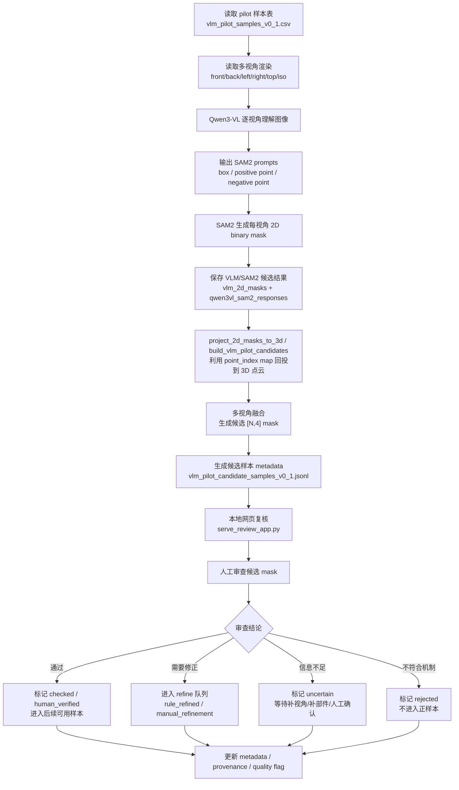

# Qwen3-VL + SAM2 候选标注流程图

记录日期：2026-05-12 +08:00

本文档只保留当前用于汇报的候选标注主流程。该流程从 pilot 样本读取开始，到 VLM/SAM2 生成 2D 候选 mask、回投融合为 3D 候选 mask，再进入网页人工审查和 metadata 更新。

## 汇报时需要强调的边界

- Qwen3-VL + SAM2 输出的是候选标注，不是最终 ground truth。
- 2D mask 回投到 3D 依赖多视角渲染阶段保存的 `point_index map`。
- 多视角融合后的 `[N,4]` mask 仍然需要人工审查。
- 人工审查结论分为通过、需要修正、信息不足和不符合机制四类，并写回 metadata 的 provenance 与 quality flag。
