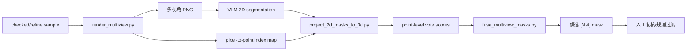

# VLM 多视角辅助精修小试验设计

生成时间：2026-05-07 20:18 +08:00

本设计用于验证“多视角 2D 分割结果投影回 3D 点云”是否能帮助修正 Multi-EE Affordance Dataset v0.1 中的 `refine` / `add_missing` 样本。当前阶段不全量运行，不把 VLM 作为最终逐点标签生成器，只把它作为候选区域建议器。

## 1. 目标

对人工审查中发现的问题样本，先挑选 5 到 10 条做 pilot：

- 输入：单个 object-task 样本的点云、多视角渲染图、任务、执行器定义。
- VLM 输出：每个视角上的 2D 二值 mask。
- 几何回投：利用渲染时保存的 pixel-to-point index map，将 2D mask 投票回 3D 点云。
- 融合输出：得到候选的 [N, 4] mask 或某个执行器通道的候选 mask。
- 人工复核：VLM 回投结果必须经过人工检查，不能直接作为 verified 标签。

## 2. 为什么可行

这个方向是可行的，因为点云渲染时可以保存每个像素对应的 3D 点索引。只要 VLM 在 2D 图像上给出 mask，就能把被标中的像素映射回对应的点，并通过多视角投票减少单视角遮挡和误分割。

但它不是无条件可靠：

- 点云渲染图缺少真实纹理，VLM 可能看不出把手内孔、按钮、耳机连接处等细节。
- 2D 分割边界投回 3D 后会有遮挡误差和像素膨胀误差。
- VLM 对“执行器物理可行性”的理解可能偏语义化，例如把所有把手都标给 hook。
- suction 的面积、曲率、法向一致性仍必须用几何规则二次过滤。

因此当前策略是：VLM 只生成候选区域，最终标签仍由几何规则 + 人工审查确认。

## 3. 最小流程



## 4. 脚本职责

### `tools/render_multiview.py`

作用：对单个样本渲染多视角点云图，并保存每个视角的 `point_index.npy`。

主要输出：

- `{view}_render.png`
- `{view}_point_index.npy`
- `{view}_depth.npy`
- `view_manifest.json`

示例：

```powershell
python MultiEEAffordance\tools\render_multiview.py `
  --dataset-root MultiEEAffordance `
  --sample-id 3danet_full_ba66302db9cfa0147286af1ad775d13a_open_pull `
  --overwrite
```

### `tools/project_2d_masks_to_3d.py`

作用：读取 VLM 输出的 2D mask 和渲染时保存的 index map，统计每个 3D 点被多少视角投票为正。

示例：

```powershell
python MultiEEAffordance\tools\project_2d_masks_to_3d.py `
  --view-manifest MultiEEAffordance\processed\vlm_pilot\renders\SAMPLE_ID\view_manifest.json `
  --mask-dir MultiEEAffordance\processed\vlm_pilot\vlm_2d_masks\SAMPLE_ID\hook `
  --executor hook `
  --output MultiEEAffordance\processed\vlm_pilot\projected\SAMPLE_ID_hook_votes.npz
```

### `tools/fuse_multiview_masks.py`

作用：把多视角投票分数融合成点级候选 mask，可单独替换某个执行器通道，也可输出完整 [N,4]。

示例：

```powershell
python MultiEEAffordance\tools\fuse_multiview_masks.py `
  --projection-npz MultiEEAffordance\processed\vlm_pilot\projected\SAMPLE_ID_hook_votes.npz `
  --existing-mask MultiEEAffordance\processed\masks_checked_v0_1\SAMPLE_ID.npy `
  --executor hook `
  --score-threshold 0.45 `
  --min-visible 2 `
  --output-mask MultiEEAffordance\processed\vlm_pilot\fused_masks\SAMPLE_ID.npy
```

### `vlm_prompt_templates.yaml`

作用：固定 VLM 提示词模板，避免不同样本的语言标准漂移。

### `tools/run_openai_vlm_pilot.py`

作用：调用 OpenAI vision model，对每条 pilot 的 6 个视角输出多边形候选区域，并栅格化成 per-view 2D mask。

输出：

- `processed/vlm_pilot/vlm_responses/{pilot_id}/response.json`
- `processed/vlm_pilot/vlm_2d_masks/{sample_id}/{executor}/{view}.npy`
- `processed/vlm_pilot/vlm_2d_masks/{sample_id}/{executor}/{view}.png`

### `tools/build_vlm_pilot_candidates.py`

作用：批量读取 VLM 2D mask，完成回投、融合和候选样本表生成，方便直接进入网页复核。

输出：

- `processed/vlm_pilot/projected/`
- `processed/vlm_pilot/fused_masks/`
- `processed/metadata/vlm_pilot_candidate_samples_v0_1.jsonl`
- `processed/metadata/vlm_pilot_candidate_summary_v0_1.json`
- `splits_vlm_pilot_candidates/`

## 5. pilot 样本选择原则

优先选择满足以下条件的样本：

- 人工审查为 `refine` 或 `add_missing`。
- 物体结构在多视角点云中可辨认。
- 覆盖不同执行器，尤其是 hook、suction、dexterous_hand。
- 覆盖不同错误类型，包括 `missing_positive`、`over_label`、`wrong_region`、`under_label`。
- 不从一开始全量跑 61 条，先验证流程是否稳定。

## 6. 是否还需要人工审查

需要。VLM pipeline 不能替代已经完成的人工审查，原因是：

- 人工审查给出了哪些样本该保留、哪些任务不匹配、哪些通道需要修，这是 pilot 的输入依据。
- VLM 生成的是候选 mask，不是最终标签。
- 对执行器物理可行性，人工规则仍然比通用 VLM 更稳定。

后续人工工作会从“从零判断每个样本”转为“审查 VLM/规则生成的候选修正版”，工作量会减少，但不会消失。

## 7. 下一步

1. 用 `vlm_pilot_samples_v0_1.csv` 中的 5 到 10 条样本生成多视角渲染。
2. 手动或通过 VLM 对这些渲染图输出 2D mask。
3. 运行投影和融合脚本生成候选 3D mask。
4. 在网页可视化工具中对候选 mask 做人工复核。
5. 根据 pilot 结果决定是否扩展到更多 refine 队列样本。
